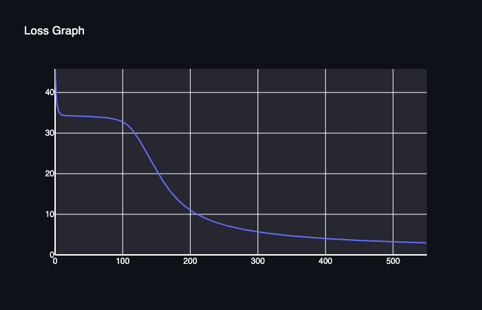
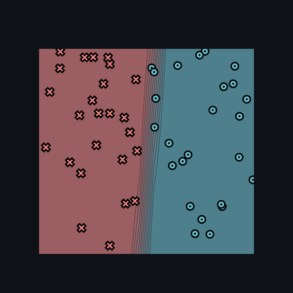
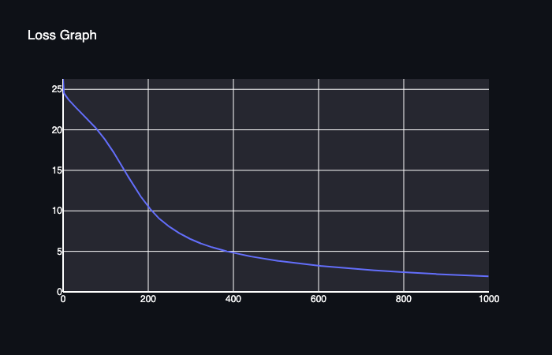
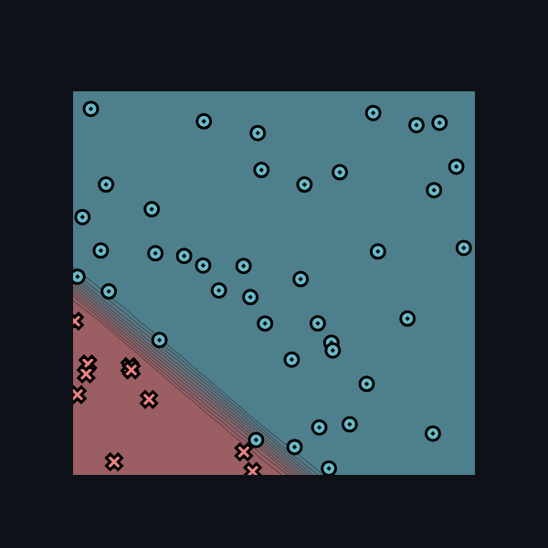
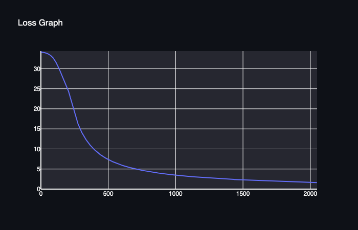
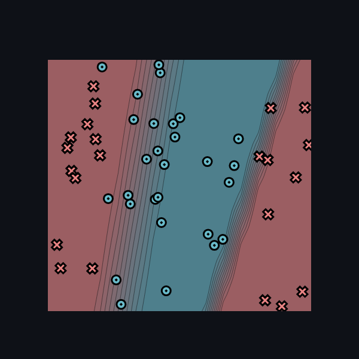
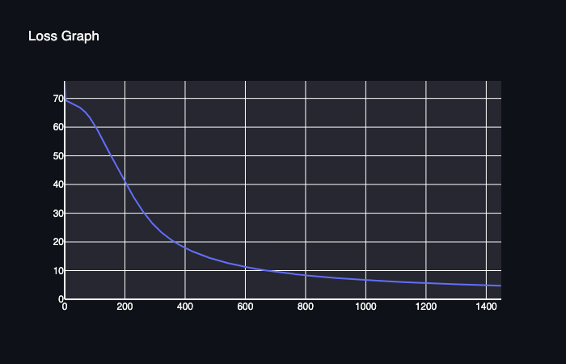
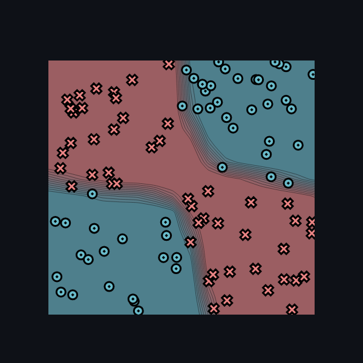

# MiniTorch Module 2


* Docs: https://minitorch.github.io/

* Overview: https://minitorch.github.io/module2/module2/

This assignment requires the following files from the previous assignments. You can get these by running

```bash
python sync_previous_module.py previous-module-dir current-module-dir
```

The files that will be synced are:

        minitorch/operators.py minitorch/module.py minitorch/autodiff.py minitorch/scalar.py minitorch/scalar_functions.py minitorch/module.py project/run_manual.py project/run_scalar.py project/datasets.py


**Simple**
Number of Points: 50

Parameters

Hidden Layers:2, Learning Rate: 0.5, Num Epochs: 550

Loss Graph:


Plot:


Log:
Epoch: 0/500, loss: 0, correct: 0
Epoch: 10/550, loss: 34.55213280832708, correct: 25
Epoch: 20/550, loss: 34.294007232617425, correct: 48
Epoch: 30/550, loss: 34.23542437115605, correct: 43
Epoch: 40/550, loss: 34.177644341826536, correct: 42
Epoch: 50/550, loss: 34.11226344934286, correct: 42
Epoch: 60/550, loss: 34.03038451905719, correct: 41
Epoch: 70/550, loss: 33.91509869514134, correct: 41
Epoch: 80/550, loss: 33.732812508160144, correct: 41
Epoch: 90/550, loss: 33.41567385936615, correct: 41
Epoch: 100/550, loss: 32.82699882194417, correct: 43
Epoch: 110/550, loss: 31.70580702181445, correct: 44
Epoch: 120/550, loss: 29.67072757802217, correct: 46
Epoch: 130/550, loss: 27.067775189238947, correct: 46
Epoch: 140/550, loss: 24.117952127444894, correct: 45
Epoch: 150/550, loss: 21.120678356131464, correct: 46
Epoch: 160/550, loss: 18.34698166075864, correct: 46
Epoch: 170/550, loss: 15.979905780617072, correct: 46
Epoch: 180/550, loss: 14.017185584248727, correct: 46
Epoch: 190/550, loss: 12.419150303118357, correct: 46
Epoch: 200/550, loss: 11.135246400323153, correct: 46
Epoch: 210/550, loss: 10.098325157506883, correct: 47
Epoch: 220/550, loss: 9.246935486913106, correct: 48
Epoch: 230/550, loss: 8.536792916272645, correct: 48
Epoch: 240/550, loss: 7.936456935939062, correct: 48
Epoch: 250/550, loss: 7.426753400857092, correct: 48
Epoch: 260/550, loss: 6.982624470397918, correct: 48
Epoch: 270/550, loss: 6.5928715382753476, correct: 49
Epoch: 280/550, loss: 6.255853500413138, correct: 49
Epoch: 290/550, loss: 5.957232433999136, correct: 49
Epoch: 300/550, loss: 5.689502291631361, correct: 49
Epoch: 310/550, loss: 5.448264157237843, correct: 49
Epoch: 320/550, loss: 5.229895196327065, correct: 49
Epoch: 330/550, loss: 5.031380726297683, correct: 49
Epoch: 340/550, loss: 4.850191598624238, correct: 50
Epoch: 350/550, loss: 4.684191728189554, correct: 50
Epoch: 360/550, loss: 4.531566617622043, correct: 50
Epoch: 370/550, loss: 4.390767076313069, correct: 50
Epoch: 380/550, loss: 4.2604642809159365, correct: 50
Epoch: 390/550, loss: 4.139513506373653, correct: 50
Epoch: 400/550, loss: 4.026924607638377, correct: 50
Epoch: 410/550, loss: 3.9218378308419073, correct: 50
Epoch: 420/550, loss: 3.8240351844894573, correct: 50
Epoch: 430/550, loss: 3.7339634707480154, correct: 50
Epoch: 440/550, loss: 3.6490990186064587, correct: 50
Epoch: 450/550, loss: 3.5689753737440757, correct: 50
Epoch: 460/550, loss: 3.493183706100984, correct: 50
Epoch: 470/550, loss: 3.421360578699789, correct: 50
Epoch: 480/550, loss: 3.353181913977389, correct: 50
Epoch: 490/550, loss: 3.2883578902826733, correct: 50
Epoch: 500/550, loss: 3.226749287162107, correct: 50
Epoch: 510/550, loss: 3.169050806561392, correct: 50
Epoch: 520/550, loss: 3.113989651322167, correct: 50
Epoch: 530/550, loss: 3.0612596572267736, correct: 50
Epoch: 540/550, loss: 3.0107021600823853, correct: 50
Epoch: 550/550, loss: 2.962172890340344, correct: 50


**Diagonal**

Number of Points: 50

Parameters
Hidden Layers: 4 Learning Rate: 0.5, Num Epochs: 1000

Loss Graph:


Plot:


Log:
Epoch: 0/1000, loss: 0, correct: 0
Epoch: 10/1000, loss: 23.988563076597753, correct: 40
Epoch: 20/1000, loss: 23.35995742393146, correct: 40
Epoch: 30/1000, loss: 22.80909575435064, correct: 40
Epoch: 40/1000, loss: 22.29037261544977, correct: 40
Epoch: 50/1000, loss: 21.776309358808284, correct: 40
Epoch: 60/1000, loss: 21.248469215250086, correct: 40
Epoch: 70/1000, loss: 20.693081077555917, correct: 40
Epoch: 80/1000, loss: 20.099017892161896, correct: 40
Epoch: 90/1000, loss: 19.457181079756854, correct: 40
Epoch: 100/1000, loss: 18.760940041527675, correct: 40
Epoch: 110/1000, loss: 18.007415230868094, correct: 40
Epoch: 120/1000, loss: 17.19917407838935, correct: 40
Epoch: 130/1000, loss: 16.345496713440006, correct: 40
Epoch: 140/1000, loss: 15.46220259321358, correct: 41
Epoch: 150/1000, loss: 14.56957170168672, correct: 42
Epoch: 160/1000, loss: 13.688966772407559, correct: 42
Epoch: 170/1000, loss: 12.839486708035377, correct: 43
Epoch: 180/1000, loss: 12.035764190217298, correct: 44
Epoch: 190/1000, loss: 11.28722377480973, correct: 45
Epoch: 200/1000, loss: 10.598465438167326, correct: 45
Epoch: 210/1000, loss: 9.970235168444855, correct: 45
Epoch: 220/1000, loss: 9.40054584349055, correct: 49
Epoch: 230/1000, loss: 8.897892141307842, correct: 49
Epoch: 240/1000, loss: 8.461428212711754, correct: 49
Epoch: 250/1000, loss: 8.06280343768242, correct: 49
Epoch: 260/1000, loss: 7.698523865776111, correct: 50
Epoch: 270/1000, loss: 7.365311703867152, correct: 50
Epoch: 280/1000, loss: 7.06004449689093, correct: 50
Epoch: 290/1000, loss: 6.779820447087781, correct: 50
Epoch: 300/1000, loss: 6.521990153335502, correct: 50
Epoch: 310/1000, loss: 6.284165355792957, correct: 50
Epoch: 320/1000, loss: 6.0698975672941415, correct: 50
Epoch: 330/1000, loss: 5.8722210207424155, correct: 50
Epoch: 340/1000, loss: 5.685482436101679, correct: 50
Epoch: 350/1000, loss: 5.517497264173952, correct: 50
Epoch: 360/1000, loss: 5.362818810646445, correct: 50
Epoch: 370/1000, loss: 5.21719604123439, correct: 50
Epoch: 380/1000, loss: 5.079641540711423, correct: 50
Epoch: 390/1000, loss: 4.949458329856192, correct: 50
Epoch: 400/1000, loss: 4.826025621538543, correct: 50
Epoch: 410/1000, loss: 4.70878930743676, correct: 50
Epoch: 420/1000, loss: 4.5972539371653065, correct: 50
Epoch: 430/1000, loss: 4.4909757625884925, correct: 50
Epoch: 440/1000, loss: 4.3895566479231425, correct: 50
Epoch: 450/1000, loss: 4.292638722270649, correct: 50
Epoch: 460/1000, loss: 4.199899683059132, correct: 50
Epoch: 470/1000, loss: 4.111048673841317, correct: 50
Epoch: 480/1000, loss: 4.025822668790817, correct: 50
Epoch: 490/1000, loss: 3.943983303108792, correct: 50
Epoch: 500/1000, loss: 3.865314094738433, correct: 50
Epoch: 510/1000, loss: 3.789618008625708, correct: 50
Epoch: 520/1000, loss: 3.7246774116501737, correct: 50
Epoch: 530/1000, loss: 3.673158273810866, correct: 50
Epoch: 540/1000, loss: 3.615126569687022, correct: 50
Epoch: 550/1000, loss: 3.553980571844417, correct: 50
Epoch: 560/1000, loss: 3.4925867251969027, correct: 50
Epoch: 570/1000, loss: 3.423037088363494, correct: 50
Epoch: 580/1000, loss: 3.3458888387898655, correct: 50
Epoch: 590/1000, loss: 3.287796009270573, correct: 50
Epoch: 600/1000, loss: 3.2336879210418337, correct: 50
Epoch: 610/1000, loss: 3.1814742450967044, correct: 50
Epoch: 620/1000, loss: 3.130795613042756, correct: 50
Epoch: 630/1000, loss: 3.081543792517405, correct: 50
Epoch: 640/1000, loss: 3.0336521991213616, correct: 50
Epoch: 650/1000, loss: 2.9870639789962663, correct: 50
Epoch: 660/1000, loss: 2.9417266338709376, correct: 50
Epoch: 670/1000, loss: 2.8975908864980444, correct: 50
Epoch: 680/1000, loss: 2.854610282834296, correct: 50
Epoch: 690/1000, loss: 2.812740945206421, correct: 50
Epoch: 700/1000, loss: 2.7719413708077956, correct: 50
Epoch: 710/1000, loss: 2.7321906812296417, correct: 50
Epoch: 720/1000, loss: 2.6934356134412623, correct: 50
Epoch: 730/1000, loss: 2.6575761149877226, correct: 50
Epoch: 740/1000, loss: 2.6361340413238263, correct: 50
Epoch: 750/1000, loss: 2.6088311071638897, correct: 50
Epoch: 760/1000, loss: 2.576551983541485, correct: 50
Epoch: 770/1000, loss: 2.542441110439401, correct: 50
Epoch: 780/1000, loss: 2.5081108747060767, correct: 50
Epoch: 790/1000, loss: 2.4742282574993215, correct: 50
Epoch: 800/1000, loss: 2.4399360920556803, correct: 50
Epoch: 810/1000, loss: 2.39208789585413, correct: 50
Epoch: 820/1000, loss: 2.3608712147699435, correct: 50
Epoch: 830/1000, loss: 2.33173856057994, correct: 50
Epoch: 840/1000, loss: 2.3033343665846617, correct: 50
Epoch: 850/1000, loss: 2.275532797229589, correct: 50
Epoch: 860/1000, loss: 2.248308075412971, correct: 50
Epoch: 870/1000, loss: 2.2216430699218, correct: 50
Epoch: 880/1000, loss: 2.195521984312927, correct: 50
Epoch: 890/1000, loss: 2.1699297020532056, correct: 50
Epoch: 900/1000, loss: 2.144851680008128, correct: 50
Epoch: 910/1000, loss: 2.1202739030572566, correct: 50
Epoch: 920/1000, loss: 2.0961828526757746, correct: 50
Epoch: 930/1000, loss: 2.0725654812327314, correct: 50
Epoch: 940/1000, loss: 2.0494091893648387, correct: 50
Epoch: 950/1000, loss: 2.02670180534507, correct: 50
Epoch: 960/1000, loss: 2.0044315659520677, correct: 50
Epoch: 970/1000, loss: 1.9825870985857588, correct: 50
Epoch: 980/1000, loss: 1.9611574044761422, correct: 50
Epoch: 990/1000, loss: 1.9401318428781853, correct: 50
Epoch: 1000/1000, loss: 1.9195001161685916, correct: 50


**Split**
Parameters

num points: 50, Hidden Layers: 5, Learning Rate: 0.5, Num Epochs: 2050

Loss Graph:


Plot:


Log:
Epoch: 0/2050, loss: 0, correct: 0
Epoch: 10/2050, loss: 34.07613246755696, correct: 28
Epoch: 20/2050, loss: 34.03049675048182, correct: 28
Epoch: 30/2050, loss: 33.98156895429536, correct: 28
Epoch: 40/2050, loss: 33.90631950875706, correct: 28
Epoch: 50/2050, loss: 33.76530486201959, correct: 28
Epoch: 60/2050, loss: 33.58492192374153, correct: 28
Epoch: 70/2050, loss: 33.36808928734058, correct: 28
Epoch: 80/2050, loss: 33.084971135214836, correct: 28
Epoch: 90/2050, loss: 32.72390902451389, correct: 30
Epoch: 100/2050, loss: 32.27677530509566, correct: 36
Epoch: 110/2050, loss: 31.741614075926005, correct: 37
Epoch: 120/2050, loss: 31.122627370060304, correct: 39
Epoch: 130/2050, loss: 30.431090267136344, correct: 39
Epoch: 140/2050, loss: 29.67954964345329, correct: 39
Epoch: 150/2050, loss: 28.87893489137542, correct: 38
Epoch: 160/2050, loss: 28.084064069766068, correct: 38
Epoch: 170/2050, loss: 27.293378339883876, correct: 38
Epoch: 180/2050, loss: 26.4836915475766, correct: 38
Epoch: 190/2050, loss: 25.657550622374135, correct: 38
Epoch: 200/2050, loss: 24.865546407842015, correct: 39
Epoch: 210/2050, loss: 23.965390611715033, correct: 40
Epoch: 220/2050, loss: 22.730963959756128, correct: 42
Epoch: 230/2050, loss: 21.474319257086957, correct: 42
Epoch: 240/2050, loss: 20.282018463148297, correct: 45
Epoch: 250/2050, loss: 19.05617450177714, correct: 45
Epoch: 260/2050, loss: 17.886197616512206, correct: 46
Epoch: 270/2050, loss: 16.86183577888581, correct: 46
Epoch: 280/2050, loss: 15.938209853377085, correct: 47
Epoch: 290/2050, loss: 15.124792050969813, correct: 47
Epoch: 300/2050, loss: 14.403685662031357, correct: 48
Epoch: 310/2050, loss: 13.755240832575389, correct: 48
Epoch: 320/2050, loss: 13.161968703373757, correct: 49
Epoch: 330/2050, loss: 12.614475732161987, correct: 49
Epoch: 340/2050, loss: 12.10738811182114, correct: 49
Epoch: 350/2050, loss: 11.638473817178284, correct: 49
Epoch: 360/2050, loss: 11.210421353396148, correct: 49
Epoch: 370/2050, loss: 10.811133864793028, correct: 49
Epoch: 380/2050, loss: 10.4375165841127, correct: 49
Epoch: 390/2050, loss: 10.087356374426927, correct: 49
Epoch: 400/2050, loss: 9.758736249630964, correct: 49
Epoch: 410/2050, loss: 9.449960858892746, correct: 49
Epoch: 420/2050, loss: 9.159508211244997, correct: 49
Epoch: 430/2050, loss: 8.885997872608138, correct: 49
Epoch: 440/2050, loss: 8.634198061578042, correct: 49
Epoch: 450/2050, loss: 8.396934691640556, correct: 49
Epoch: 460/2050, loss: 8.171965767029034, correct: 49
Epoch: 470/2050, loss: 7.958943792303147, correct: 49
Epoch: 480/2050, loss: 7.7586900943411266, correct: 49
Epoch: 490/2050, loss: 7.568421203970235, correct: 49
Epoch: 500/2050, loss: 7.387290832575236, correct: 49
Epoch: 510/2050, loss: 7.214717288324365, correct: 49
Epoch: 520/2050, loss: 7.050161718292961, correct: 49
Epoch: 530/2050, loss: 6.893123882136387, correct: 49
Epoch: 540/2050, loss: 6.74313876641894, correct: 49
Epoch: 550/2050, loss: 6.599773765402075, correct: 49
Epoch: 560/2050, loss: 6.4626262492940665, correct: 49
Epoch: 570/2050, loss: 6.331627304968444, correct: 49
Epoch: 580/2050, loss: 6.20719645201118, correct: 49
Epoch: 590/2050, loss: 6.087939185665421, correct: 49
Epoch: 600/2050, loss: 5.973439831042202, correct: 49
Epoch: 610/2050, loss: 5.863422323569502, correct: 49
Epoch: 620/2050, loss: 5.75763009336256, correct: 49
Epoch: 630/2050, loss: 5.655824532643711, correct: 49
Epoch: 640/2050, loss: 5.557783595698927, correct: 49
Epoch: 650/2050, loss: 5.463300515987759, correct: 49
Epoch: 660/2050, loss: 5.372298061575455, correct: 49
Epoch: 670/2050, loss: 5.284764047692512, correct: 49
Epoch: 680/2050, loss: 5.200459139065227, correct: 49
Epoch: 690/2050, loss: 5.119006461672183, correct: 49
Epoch: 700/2050, loss: 5.04025457902247, correct: 49
Epoch: 710/2050, loss: 4.964063100634964, correct: 49
Epoch: 720/2050, loss: 4.890301571729124, correct: 49
Epoch: 730/2050, loss: 4.818848523444546, correct: 49
Epoch: 740/2050, loss: 4.749590651767278, correct: 49
Epoch: 750/2050, loss: 4.682422100873442, correct: 49
Epoch: 760/2050, loss: 4.6172438322425595, correct: 49
Epoch: 770/2050, loss: 4.553963065111883, correct: 49
Epoch: 780/2050, loss: 4.492492777000533, correct: 49
Epoch: 790/2050, loss: 4.432751255400131, correct: 49
Epoch: 800/2050, loss: 4.374661693513064, correct: 49
Epoch: 810/2050, loss: 4.318151824271928, correct: 49
Epoch: 820/2050, loss: 4.263153587908008, correct: 49
Epoch: 830/2050, loss: 4.2096028291345045, correct: 49
Epoch: 840/2050, loss: 4.1574390206339045, correct: 49
Epoch: 850/2050, loss: 4.106806537197399, correct: 49
Epoch: 860/2050, loss: 4.0577064682699815, correct: 49
Epoch: 870/2050, loss: 4.010206620704821, correct: 49
Epoch: 880/2050, loss: 3.963978721696863, correct: 49
Epoch: 890/2050, loss: 3.918824930802044, correct: 49
Epoch: 900/2050, loss: 3.8747040747911505, correct: 49
Epoch: 910/2050, loss: 3.8315773724069127, correct: 49
Epoch: 920/2050, loss: 3.7894082007097416, correct: 49
Epoch: 930/2050, loss: 3.7481619019945738, correct: 49
Epoch: 940/2050, loss: 3.707805621154579, correct: 49
Epoch: 950/2050, loss: 3.6683081662786297, correct: 49
Epoch: 960/2050, loss: 3.6296398873073294, correct: 49
Epoch: 970/2050, loss: 3.5917725690000286, correct: 49
Epoch: 980/2050, loss: 3.5546793354682706, correct: 49
Epoch: 990/2050, loss: 3.518334564238271, correct: 49
Epoch: 1000/2050, loss: 3.4827138083063747, correct: 49
Epoch: 1010/2050, loss: 3.447793725009253, correct: 49
Epoch: 1020/2050, loss: 3.4135520107886625, correct: 49
Epoch: 1030/2050, loss: 3.3799673411183084, correct: 49
Epoch: 1040/2050, loss: 3.347019314999072, correct: 49
Epoch: 1050/2050, loss: 3.3146884035324615, correct: 49
Epoch: 1060/2050, loss: 3.282955902161332, correct: 49
Epoch: 1070/2050, loss: 3.2518038862277883, correct: 49
Epoch: 1080/2050, loss: 3.2212151695464892, correct: 49
Epoch: 1090/2050, loss: 3.1911732657301717, correct: 49
Epoch: 1100/2050, loss: 3.161662352035564, correct: 50
Epoch: 1110/2050, loss: 3.132667235524164, correct: 50
Epoch: 1120/2050, loss: 3.1041733213540383, correct: 50
Epoch: 1130/2050, loss: 3.076166583037799, correct: 50
Epoch: 1140/2050, loss: 3.048633534517738, correct: 50
Epoch: 1150/2050, loss: 3.0215612039232123, correct: 50
Epoch: 1160/2050, loss: 2.9949371088877736, correct: 50
Epoch: 1170/2050, loss: 2.9687492333141265, correct: 50
Epoch: 1180/2050, loss: 2.9429860054849892, correct: 50
Epoch: 1190/2050, loss: 2.9176362774261393, correct: 50
Epoch: 1200/2050, loss: 2.8926893054360656, correct: 50
Epoch: 1210/2050, loss: 2.868134731703284, correct: 50
Epoch: 1220/2050, loss: 2.8439625669388713, correct: 50
Epoch: 1230/2050, loss: 2.8202016210688186, correct: 50
Epoch: 1240/2050, loss: 2.796938946467905, correct: 50
Epoch: 1250/2050, loss: 2.774040863682417, correct: 50
Epoch: 1260/2050, loss: 2.751478680365654, correct: 50
Epoch: 1270/2050, loss: 2.729244504723968, correct: 50
Epoch: 1280/2050, loss: 2.7073307044872825, correct: 50
Epoch: 1290/2050, loss: 2.6857298958906592, correct: 50
Epoch: 1300/2050, loss: 2.6644349332668282, correct: 50
Epoch: 1310/2050, loss: 2.6434388992041242, correct: 50
Epoch: 1320/2050, loss: 2.6227350952288626, correct: 50
Epoch: 1330/2050, loss: 2.6023170329749714, correct: 50
Epoch: 1340/2050, loss: 2.5821784258072285, correct: 50
Epoch: 1350/2050, loss: 2.5623131808674393, correct: 50
Epoch: 1360/2050, loss: 2.542715391515677, correct: 50
Epoch: 1370/2050, loss: 2.523379330141012, correct: 50
Epoch: 1380/2050, loss: 2.5042994413183712, correct: 50
Epoch: 1390/2050, loss: 2.485470335290097, correct: 50
Epoch: 1400/2050, loss: 2.4668867817524807, correct: 50
Epoch: 1410/2050, loss: 2.4485437039290727, correct: 50
Epoch: 1420/2050, loss: 2.4304361729139634, correct: 50
Epoch: 1430/2050, loss: 2.412559402269642, correct: 50
Epoch: 1440/2050, loss: 2.3949087428648745, correct: 50
Epoch: 1450/2050, loss: 2.37747967793945, correct: 50
Epoch: 1460/2050, loss: 2.360267818383253, correct: 50
Epoch: 1470/2050, loss: 2.3432688982182386, correct: 50
Epoch: 1480/2050, loss: 2.3264787702724714, correct: 50
Epoch: 1490/2050, loss: 2.309893402036295, correct: 50
Epoch: 1500/2050, loss: 2.293508871691154, correct: 50
Epoch: 1510/2050, loss: 2.277321364302406, correct: 50
Epoch: 1520/2050, loss: 2.2613271681677967, correct: 50
Epoch: 1530/2050, loss: 2.2455226713140504, correct: 50
Epoch: 1540/2050, loss: 2.229904358134182, correct: 50
Epoch: 1550/2050, loss: 2.214468806158839, correct: 50
Epoch: 1560/2050, loss: 2.1992126829553134, correct: 50
Epoch: 1570/2050, loss: 2.1841327431480972, correct: 50
Epoch: 1580/2050, loss: 2.169225825555427, correct: 50
Epoch: 1590/2050, loss: 2.1544888504364104, correct: 50
Epoch: 1600/2050, loss: 2.1399188168437484, correct: 50
Epoch: 1610/2050, loss: 2.1255128000771957, correct: 50
Epoch: 1620/2050, loss: 2.1112679492333766, correct: 50
Epoch: 1630/2050, loss: 2.0971814848476087, correct: 50
Epoch: 1640/2050, loss: 2.083250696623723, correct: 50
Epoch: 1650/2050, loss: 2.0694729412480912, correct: 50
Epoch: 1660/2050, loss: 2.055845640284208, correct: 50
Epoch: 1670/2050, loss: 2.0423662781443905, correct: 50
Epoch: 1680/2050, loss: 2.029032400135359, correct: 50
Epoch: 1690/2050, loss: 2.0158416105745887, correct: 50
Epoch: 1700/2050, loss: 2.0027915709744786, correct: 50
Epoch: 1710/2050, loss: 1.9898799982915696, correct: 50
Epoch: 1720/2050, loss: 1.9771046632381193, correct: 50
Epoch: 1730/2050, loss: 1.9644633886535172, correct: 50
Epoch: 1740/2050, loss: 1.951954047933117, correct: 50
Epoch: 1750/2050, loss: 1.9395745635122055, correct: 50
Epoch: 1760/2050, loss: 1.927322905402899, correct: 50
Epoch: 1770/2050, loss: 1.9151970897818544, correct: 50
Epoch: 1780/2050, loss: 1.9031951776268916, correct: 50
Epoch: 1790/2050, loss: 1.8913152734004843, correct: 50
Epoch: 1800/2050, loss: 1.8795555237784283, correct: 50
Epoch: 1810/2050, loss: 1.8679141164218565, correct: 50
Epoch: 1820/2050, loss: 1.8563892787910385, correct: 50
Epoch: 1830/2050, loss: 1.8449792769992435, correct: 50
Epoch: 1840/2050, loss: 1.833682414705276, correct: 50
Epoch: 1850/2050, loss: 1.8224970320431702, correct: 50
Epoch: 1860/2050, loss: 1.811421504587632, correct: 50
Epoch: 1870/2050, loss: 1.8004542423539438, correct: 50
Epoch: 1880/2050, loss: 1.7895936888310442, correct: 50
Epoch: 1890/2050, loss: 1.7788383200465099, correct: 50
Epoch: 1900/2050, loss: 1.76818664366236, correct: 50
Epoch: 1910/2050, loss: 1.7576371981004415, correct: 50
Epoch: 1920/2050, loss: 1.747188551696443, correct: 50
Epoch: 1930/2050, loss: 1.736839301881415, correct: 50
Epoch: 1940/2050, loss: 1.7265880743897937, correct: 50
Epoch: 1950/2050, loss: 1.7164335224930731, correct: 50
Epoch: 1960/2050, loss: 1.7063743262581053, correct: 50
Epoch: 1970/2050, loss: 1.6964091918291873, correct: 50
Epoch: 1980/2050, loss: 1.6865368507331338, correct: 50
Epoch: 1990/2050, loss: 1.676756059206425, correct: 50
Epoch: 2000/2050, loss: 1.6670655975437696, correct: 50
Epoch: 2010/2050, loss: 1.6574642694672226, correct: 50
Epoch: 2020/2050, loss: 1.6479509015152074, correct: 50
Epoch: 2030/2050, loss: 1.6385243424507137, correct: 50
Epoch: 2040/2050, loss: 1.6291834626880577, correct: 50
Epoch: 2050/2050, loss: 1.6199271537374433, correct: 50

**Xor**
Parameters
Learning Rate: 0.5
Num Epochs: 500
Loss Graph:

Plot:

Log:
Epoch: 0/1600, loss: 0, correct: 0
Epoch: 0/1600, loss: 0, correct: 0
Epoch: 0/1400, loss: 0, correct: 0
Epoch: 10/1400, loss: 69.43976237020722, correct: 65
Epoch: 20/1400, loss: 68.31520925625041, correct: 57
Epoch: 30/1400, loss: 67.30368007962589, correct: 63
Epoch: 40/1400, loss: 66.26088069622696, correct: 68
Epoch: 50/1400, loss: 65.16360380562467, correct: 69
Epoch: 60/1400, loss: 64.02899694154407, correct: 70
Epoch: 70/1400, loss: 62.8788950652522, correct: 70
Epoch: 80/1400, loss: 61.68710452403088, correct: 69
Epoch: 90/1400, loss: 60.60651006764141, correct: 68
Epoch: 100/1400, loss: 59.65350436075591, correct: 68
Epoch: 110/1400, loss: 58.845289449385, correct: 68
Epoch: 120/1400, loss: 58.17377972361843, correct: 68
Epoch: 130/1400, loss: 57.62033133406016, correct: 68
Epoch: 140/1400, loss: 57.16113573726753, correct: 68
Epoch: 150/1400, loss: 56.76996612375362, correct: 68
Epoch: 160/1400, loss: 56.427287358830036, correct: 68
Epoch: 170/1400, loss: 56.11807382114774, correct: 69
Epoch: 180/1400, loss: 55.82762150521728, correct: 69
Epoch: 190/1400, loss: 55.54860755438062, correct: 70
Epoch: 200/1400, loss: 55.2770380127269, correct: 70
Epoch: 210/1400, loss: 55.00321770589541, correct: 70
Epoch: 220/1400, loss: 54.7297722467428, correct: 70
Epoch: 230/1400, loss: 54.450000582038285, correct: 70
Epoch: 240/1400, loss: 54.164927155046975, correct: 70
Epoch: 250/1400, loss: 53.872651731416866, correct: 70
Epoch: 260/1400, loss: 53.57296918022751, correct: 70
Epoch: 270/1400, loss: 53.265089073293446, correct: 70
Epoch: 280/1400, loss: 52.948320661793566, correct: 70
Epoch: 290/1400, loss: 52.6229557095793, correct: 70
Epoch: 300/1400, loss: 52.288880923217, correct: 72
Epoch: 310/1400, loss: 51.94530480255941, correct: 72
Epoch: 320/1400, loss: 51.59192579534239, correct: 73
Epoch: 330/1400, loss: 51.228587680249476, correct: 73
Epoch: 340/1400, loss: 50.85531470996188, correct: 73
Epoch: 350/1400, loss: 50.47206620914857, correct: 73
Epoch: 360/1400, loss: 50.078991889883106, correct: 73
Epoch: 370/1400, loss: 49.68216748728044, correct: 73
Epoch: 380/1400, loss: 49.88063646684108, correct: 68
Epoch: 390/1400, loss: 71.33014209089944, correct: 56
Epoch: 400/1400, loss: 50.138212634875686, correct: 68
Epoch: 410/1400, loss: 47.76391105903094, correct: 72
Epoch: 420/1400, loss: 47.064939517432784, correct: 75
Epoch: 430/1400, loss: 46.528031667546834, correct: 75
Epoch: 440/1400, loss: 46.05061197306494, correct: 74
Epoch: 450/1400, loss: 45.87311217032785, correct: 74
Epoch: 460/1400, loss: 47.71119673469566, correct: 76
Epoch: 470/1400, loss: 53.77929859129606, correct: 65
Epoch: 480/1400, loss: 48.74542045037363, correct: 71
Epoch: 490/1400, loss: 45.46123785158618, correct: 81
Epoch: 500/1400, loss: 43.92779085731311, correct: 79
Epoch: 510/1400, loss: 43.496131811684144, correct: 83
Epoch: 520/1400, loss: 43.9036823023274, correct: 80
Epoch: 530/1400, loss: 46.74545487124379, correct: 77
Epoch: 540/1400, loss: 47.40384413601207, correct: 72
Epoch: 550/1400, loss: 43.23507495320885, correct: 80
Epoch: 560/1400, loss: 41.33965176618882, correct: 86
Epoch: 570/1400, loss: 40.91901943203555, correct: 84
Epoch: 580/1400, loss: 41.348220758376904, correct: 83
Epoch: 590/1400, loss: 42.65801937079247, correct: 80
Epoch: 600/1400, loss: 43.53703516151867, correct: 78
Epoch: 610/1400, loss: 41.59296151692866, correct: 82
Epoch: 620/1400, loss: 39.294159751184125, correct: 83
Epoch: 630/1400, loss: 38.687217696809675, correct: 84
Epoch: 640/1400, loss: 38.975176230623426, correct: 82
Epoch: 650/1400, loss: 39.939008202821995, correct: 83
Epoch: 660/1400, loss: 36.878688576268296, correct: 83
Epoch: 670/1400, loss: 34.79260170540972, correct: 92
Epoch: 680/1400, loss: 34.389611942667045, correct: 92
Epoch: 690/1400, loss: 33.435991669140776, correct: 92
Epoch: 700/1400, loss: 32.95626033066973, correct: 92
Epoch: 710/1400, loss: 32.37992629879415, correct: 92
Epoch: 720/1400, loss: 31.82431694765395, correct: 92
Epoch: 730/1400, loss: 31.32108284014052, correct: 92
Epoch: 740/1400, loss: 30.815728863370694, correct: 92
Epoch: 750/1400, loss: 30.218013228494456, correct: 92
Epoch: 760/1400, loss: 29.67792598353668, correct: 92
Epoch: 770/1400, loss: 29.147000697177855, correct: 92
Epoch: 780/1400, loss: 28.657525974075426, correct: 93
Epoch: 790/1400, loss: 28.18505036668836, correct: 92
Epoch: 800/1400, loss: 27.738283161077074, correct: 92
Epoch: 810/1400, loss: 27.311155208224292, correct: 92
Epoch: 820/1400, loss: 26.90436367918157, correct: 93
Epoch: 830/1400, loss: 26.51446788431484, correct: 92
Epoch: 840/1400, loss: 26.14163511970278, correct: 92
Epoch: 850/1400, loss: 25.785169873825993, correct: 91
Epoch: 860/1400, loss: 25.44446894727407, correct: 90
Epoch: 870/1400, loss: 25.11831244838253, correct: 90
Epoch: 880/1400, loss: 24.805562057180367, correct: 90
Epoch: 890/1400, loss: 24.505667333307464, correct: 90
Epoch: 900/1400, loss: 24.21832479918941, correct: 90
Epoch: 910/1400, loss: 23.94359994697386, correct: 91
Epoch: 920/1400, loss: 23.69268456032184, correct: 91
Epoch: 930/1400, loss: 23.435384618987573, correct: 91
Epoch: 940/1400, loss: 23.231268545705415, correct: 91
Epoch: 950/1400, loss: 23.025996991207165, correct: 91
Epoch: 960/1400, loss: 22.98222513024987, correct: 93
Epoch: 970/1400, loss: 22.96480958530626, correct: 94
Epoch: 980/1400, loss: 23.241941942308998, correct: 95
Epoch: 990/1400, loss: 23.43872337359606, correct: 95
Epoch: 1000/1400, loss: 23.765682397673093, correct: 94
Epoch: 1010/1400, loss: 23.79687260863956, correct: 94
Epoch: 1020/1400, loss: 23.417185991558433, correct: 94
Epoch: 1030/1400, loss: 22.86675838754747, correct: 95
Epoch: 1040/1400, loss: 22.040940045297845, correct: 94
Epoch: 1050/1400, loss: 21.335047750841923, correct: 93
Epoch: 1060/1400, loss: 20.969945044451062, correct: 91
Epoch: 1070/1400, loss: 20.81565147546379, correct: 92
Epoch: 1080/1400, loss: 20.69544874932034, correct: 92
Epoch: 1090/1400, loss: 20.758309049473606, correct: 93
Epoch: 1100/1400, loss: 20.915845244789036, correct: 93
Epoch: 1110/1400, loss: 22.44704106711685, correct: 94
Epoch: 1120/1400, loss: 26.347872945852608, correct: 88
Epoch: 1130/1400, loss: 24.951456921896117, correct: 91
Epoch: 1140/1400, loss: 21.171783957227827, correct: 95
Epoch: 1150/1400, loss: 19.958547705082182, correct: 93
Epoch: 1160/1400, loss: 19.60775283618635, correct: 92
Epoch: 1170/1400, loss: 19.437292805252458, correct: 92
Epoch: 1180/1400, loss: 19.293991044231532, correct: 92
Epoch: 1190/1400, loss: 19.166346983362597, correct: 92
Epoch: 1200/1400, loss: 19.054563481275782, correct: 92
Epoch: 1210/1400, loss: 19.135957392105208, correct: 92
Epoch: 1220/1400, loss: 20.210766773642927, correct: 95
Epoch: 1230/1400, loss: 25.039032606415756, correct: 89
Epoch: 1240/1400, loss: 25.916891448598157, correct: 87
Epoch: 1250/1400, loss: 21.69732710226599, correct: 93
Epoch: 1260/1400, loss: 19.00550915461177, correct: 93
Epoch: 1270/1400, loss: 18.49764407177613, correct: 92
Epoch: 1280/1400, loss: 18.298946905032683, correct: 92
Epoch: 1290/1400, loss: 18.16692108682964, correct: 92
Epoch: 1300/1400, loss: 18.050943737992082, correct: 92
Epoch: 1310/1400, loss: 17.94096366114394, correct: 92
Epoch: 1320/1400, loss: 17.841181355892488, correct: 92
Epoch: 1330/1400, loss: 17.83448938077998, correct: 92
Epoch: 1340/1400, loss: 18.348563349309863, correct: 93
Epoch: 1350/1400, loss: 23.18214787963798, correct: 92
Epoch: 1360/1400, loss: 26.090256689749694, correct: 87
Epoch: 1370/1400, loss: 21.74293160176588, correct: 93
Epoch: 1380/1400, loss: 18.360431067145218, correct: 94
Epoch: 1390/1400, loss: 17.560008188936905, correct: 92
Epoch: 1400/1400, loss: 17.295526994725126, correct: 92
Epoch: 0/1425, loss: 0, correct: 0
Epoch: 0/1450, loss: 0, correct: 0
Epoch: 10/1450, loss: 68.99976627591866, correct: 61
Epoch: 20/1450, loss: 68.59135499708974, correct: 54
Epoch: 30/1450, loss: 68.15625902535525, correct: 52
Epoch: 40/1450, loss: 67.58716379670192, correct: 51
Epoch: 50/1450, loss: 66.91753058524387, correct: 60
Epoch: 60/1450, loss: 66.12514988294888, correct: 63
Epoch: 70/1450, loss: 65.1549184073675, correct: 70
Epoch: 80/1450, loss: 63.916768230888344, correct: 72
Epoch: 90/1450, loss: 62.4646348120304, correct: 73
Epoch: 100/1450, loss: 60.81900009020789, correct: 74
Epoch: 110/1450, loss: 58.981220022595636, correct: 76
Epoch: 120/1450, loss: 57.01875708601943, correct: 77
Epoch: 130/1450, loss: 54.98452491708338, correct: 78
Epoch: 140/1450, loss: 52.963072729406875, correct: 78
Epoch: 150/1450, loss: 50.954684688323695, correct: 79
Epoch: 160/1450, loss: 48.963817871973305, correct: 80
Epoch: 170/1450, loss: 46.979070956653366, correct: 85
Epoch: 180/1450, loss: 44.99139204517397, correct: 86
Epoch: 190/1450, loss: 43.052411912177476, correct: 88
Epoch: 200/1450, loss: 41.11318811190889, correct: 88
Epoch: 210/1450, loss: 39.228343634368606, correct: 90
Epoch: 220/1450, loss: 37.39405133263883, correct: 91
Epoch: 230/1450, loss: 35.61455525952172, correct: 91
Epoch: 240/1450, loss: 33.90690418068257, correct: 93
Epoch: 250/1450, loss: 32.28638799314559, correct: 93
Epoch: 260/1450, loss: 30.75286248531628, correct: 95
Epoch: 270/1450, loss: 29.317376646746723, correct: 95
Epoch: 280/1450, loss: 27.97690779749324, correct: 95
Epoch: 290/1450, loss: 26.730716423797933, correct: 96
Epoch: 300/1450, loss: 25.585172970807385, correct: 96
Epoch: 310/1450, loss: 24.52414133667144, correct: 97
Epoch: 320/1450, loss: 23.55103387043721, correct: 97
Epoch: 330/1450, loss: 22.651967623229325, correct: 97
Epoch: 340/1450, loss: 21.82435231295213, correct: 97
Epoch: 350/1450, loss: 21.058109288884676, correct: 97
Epoch: 360/1450, loss: 20.34542796355671, correct: 97
Epoch: 370/1450, loss: 19.681123321929167, correct: 97
Epoch: 380/1450, loss: 19.06089841345069, correct: 97
Epoch: 390/1450, loss: 18.47940378004178, correct: 97
Epoch: 400/1450, loss: 17.932882251767424, correct: 97
Epoch: 410/1450, loss: 17.417903813323043, correct: 98
Epoch: 420/1450, loss: 16.931627866418772, correct: 98
Epoch: 430/1450, loss: 16.47162868635666, correct: 98
Epoch: 440/1450, loss: 16.035982343665875, correct: 98
Epoch: 450/1450, loss: 15.623053272722188, correct: 98
Epoch: 460/1450, loss: 15.230474438091369, correct: 98
Epoch: 470/1450, loss: 14.857543355872322, correct: 98
Epoch: 480/1450, loss: 14.504421388387398, correct: 98
Epoch: 490/1450, loss: 14.1675763980473, correct: 98
Epoch: 500/1450, loss: 13.84579019407588, correct: 98
Epoch: 510/1450, loss: 13.53831039917134, correct: 98
Epoch: 520/1450, loss: 13.244449388281165, correct: 98
Epoch: 530/1450, loss: 12.962841571719384, correct: 98
Epoch: 540/1450, loss: 12.692692556888254, correct: 98
Epoch: 550/1450, loss: 12.433351352244342, correct: 98
Epoch: 560/1450, loss: 12.184215220537798, correct: 98
Epoch: 570/1450, loss: 11.951343538418188, correct: 98
Epoch: 580/1450, loss: 11.725859737342, correct: 98
Epoch: 590/1450, loss: 11.501415710759884, correct: 98
Epoch: 600/1450, loss: 11.298274907287443, correct: 98
Epoch: 610/1450, loss: 11.095956371354145, correct: 98
Epoch: 620/1450, loss: 10.915828808764648, correct: 98
Epoch: 630/1450, loss: 10.72381696754062, correct: 98
Epoch: 640/1450, loss: 10.544150332777289, correct: 99
Epoch: 650/1450, loss: 10.380788407571293, correct: 98
Epoch: 660/1450, loss: 10.208420790925038, correct: 99
Epoch: 670/1450, loss: 10.050219037955575, correct: 99
Epoch: 680/1450, loss: 9.903299703054344, correct: 99
Epoch: 690/1450, loss: 9.74728076735315, correct: 99
Epoch: 700/1450, loss: 9.603425974606616, correct: 99
Epoch: 710/1450, loss: 9.469402058931081, correct: 99
Epoch: 720/1450, loss: 9.327955071298215, correct: 99
Epoch: 730/1450, loss: 9.204092461695494, correct: 99
Epoch: 740/1450, loss: 9.068993962547081, correct: 99
Epoch: 750/1450, loss: 8.9456186320656, correct: 99
Epoch: 760/1450, loss: 8.828133047898486, correct: 99
Epoch: 770/1450, loss: 8.7087256466769, correct: 99
Epoch: 780/1450, loss: 8.594810047797038, correct: 99
Epoch: 790/1450, loss: 8.491143040200452, correct: 99
Epoch: 800/1450, loss: 8.377158975791154, correct: 99
Epoch: 810/1450, loss: 8.278372362944305, correct: 99
Epoch: 820/1450, loss: 8.17158059076894, correct: 99
Epoch: 830/1450, loss: 8.074357454953605, correct: 99
Epoch: 840/1450, loss: 7.978088722084109, correct: 99
Epoch: 850/1450, loss: 7.888804594313947, correct: 99
Epoch: 860/1450, loss: 7.7916676182677325, correct: 99
Epoch: 870/1450, loss: 7.699422847931133, correct: 99
Epoch: 880/1450, loss: 7.613321750142534, correct: 99
Epoch: 890/1450, loss: 7.538663369878478, correct: 99
Epoch: 900/1450, loss: 7.455832475823208, correct: 99
Epoch: 910/1450, loss: 7.365107665570624, correct: 99
Epoch: 920/1450, loss: 7.2861362780369445, correct: 99
Epoch: 930/1450, loss: 7.209049953020859, correct: 99
Epoch: 940/1450, loss: 7.139100955601833, correct: 99
Epoch: 950/1450, loss: 7.062244741435346, correct: 99
Epoch: 960/1450, loss: 6.9907533386043275, correct: 99
Epoch: 970/1450, loss: 6.921772479144856, correct: 99
Epoch: 980/1450, loss: 6.851423033922696, correct: 99
Epoch: 990/1450, loss: 6.784051765312386, correct: 99
Epoch: 1000/1450, loss: 6.720786421640338, correct: 99
Epoch: 1010/1450, loss: 6.653943181423377, correct: 99
Epoch: 1020/1450, loss: 6.593464295189009, correct: 99
Epoch: 1030/1450, loss: 6.529384191687872, correct: 99
Epoch: 1040/1450, loss: 6.469765861226293, correct: 99
Epoch: 1050/1450, loss: 6.412995675640669, correct: 99
Epoch: 1060/1450, loss: 6.3531480317775575, correct: 99
Epoch: 1070/1450, loss: 6.298441269200765, correct: 99
Epoch: 1080/1450, loss: 6.240725410955461, correct: 99
Epoch: 1090/1450, loss: 6.1924979428965585, correct: 99
Epoch: 1100/1450, loss: 6.136156361299459, correct: 99
Epoch: 1110/1450, loss: 6.080834718039005, correct: 99
Epoch: 1120/1450, loss: 6.0296833236532645, correct: 99
Epoch: 1130/1450, loss: 5.981637052025081, correct: 99
Epoch: 1140/1450, loss: 5.929902935886337, correct: 99
Epoch: 1150/1450, loss: 5.881253088288993, correct: 99
Epoch: 1160/1450, loss: 5.834825481260229, correct: 99
Epoch: 1170/1450, loss: 5.788704201576558, correct: 99
Epoch: 1180/1450, loss: 5.743423335322366, correct: 99
Epoch: 1190/1450, loss: 5.698385631289425, correct: 99
Epoch: 1200/1450, loss: 5.65363831845592, correct: 99
Epoch: 1210/1450, loss: 5.608571694137162, correct: 99
Epoch: 1220/1450, loss: 5.565681174513506, correct: 99
Epoch: 1230/1450, loss: 5.524387021656784, correct: 99
Epoch: 1240/1450, loss: 5.482687516771272, correct: 99
Epoch: 1250/1450, loss: 5.444817211179064, correct: 99
Epoch: 1260/1450, loss: 5.404865736567352, correct: 99
Epoch: 1270/1450, loss: 5.362627396557956, correct: 99
Epoch: 1280/1450, loss: 5.324809269391141, correct: 99
Epoch: 1290/1450, loss: 5.287592075449236, correct: 99
Epoch: 1300/1450, loss: 5.249425673468701, correct: 99
Epoch: 1310/1450, loss: 5.212993328000026, correct: 99
Epoch: 1320/1450, loss: 5.1773413298477555, correct: 99
Epoch: 1330/1450, loss: 5.141187486469312, correct: 99
Epoch: 1340/1450, loss: 5.106577029585091, correct: 99
Epoch: 1350/1450, loss: 5.071913283826963, correct: 99
Epoch: 1360/1450, loss: 5.037443305561762, correct: 99
Epoch: 1370/1450, loss: 5.004684695736079, correct: 99
Epoch: 1380/1450, loss: 4.971010900754534, correct: 99
Epoch: 1390/1450, loss: 4.939113393715581, correct: 99
Epoch: 1400/1450, loss: 4.906659701398522, correct: 99
Epoch: 1410/1450, loss: 4.875173091666882, correct: 99
Epoch: 1420/1450, loss: 4.844175847214639, correct: 99
Epoch: 1430/1450, loss: 4.81371079210832, correct: 99
Epoch: 1440/1450, loss: 4.783679951851692, correct: 99
Epoch: 1450/1450, loss: 4.7538841085425485, correct: 99